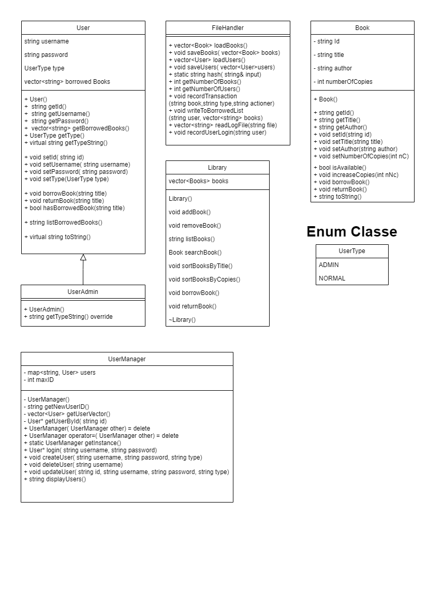
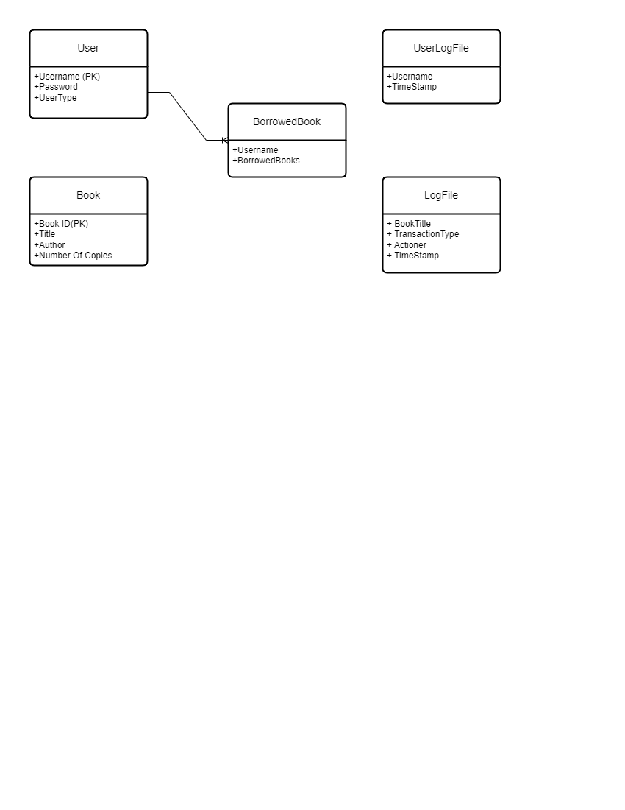

# Library Management System

## Project Description

This is a console-based Library Management System written in C++. It manages users, books, and user interactions with books. It supports different types of users like normal users and admin users with different permissions. The system is built using object-oriented programming principles and incorporates several design patterns to structure the code in a scalable, efficient, and maintainable way.

## System Requirements

To run the application, you'll need:

- Microsoft C++ compiler

## Building Instructions

To compile and run the project, navigate to the project directory and use the build tools associated with your C++ compiler.

## Architecture & Design Patterns

The system is built around several key classes, which encapsulate relevant data and functionality:

- `User` : Represents a user of the library.
- `UserAdmin` : Represents an admin user of the library. Inherits from `User`, demonstrating the use of inheritance and polymorphism.
- `Book` : Represents a book in the library.
- `Library` : Represents the library itself. It is responsible for managing books, illustrating the principle of Encapsulation.
- `UserManager` : Manages all users in the system. This class implements the Singleton design pattern to ensure that there is only one instance of UserManager in the system.
- `FileHandler` : Handles file read/write operations for saving and loading books and users.

The system relies on a range of other design patterns, such as:

- **Singleton**: The `UserManager` class is implemented as a Singleton to ensure only one instance is handling users throughout the application.
- **Factory Method**: The creation of different types of users (admin/normal) is handled through a Factory Method in the `UserManager` class.
- **Composite Design Pattern**: The library and user classes act as composite classes. The library has a collection of books, and the user has a collection of borrowed books.
- **Strategy Pattern**: Different sorting strategies are implemented for books, allowing for flexibility in sorting methods (by title or by the number of copies).

## Data Structures and Algorithms

The Library Management System uses a variety of data structures and algorithms to handle information effectively and efficiently. Here's a brief overview:

- **Data Structures**:

  - **Arrays**: Arrays are used as a basic data structure in several classes to store and manipulate the data, such as in the Book and User classes.

  - **Vectors**: Vectors, which are essentially dynamic arrays, are used to store collections of books and users in the Library and UserManager classes, respectively. This provides flexibility in storing and retrieving data and facilitates efficient searching, insertion, and deletion operations.

  - **Maps**: Maps are a significant part of the system. They're used to store user data in a way that allows quick access. With maps, you can access, insert, and delete users with an average time complexity of O(log n), making operations involving user data more efficient.

- **Algorithms**:

  - **Sorting Algorithms**: The application uses sorting algorithms to order the books based on different parameters such as title and the number of copies. This helps in providing a sorted view of the data to the users and admins.

  - **Search Algorithms**: The system uses efficient search algorithms to find specific books and users. This is used in various operations like borrowing a book, returning a book, deleting a user, etc.

The choice of these data structures and algorithms ensures the scalability of the system while providing efficient operations for a better user experience.

# UML Diagram

# ERD Diagram

# How to Use

1. When you start the application, you are presented with a login screen.
2. The application starts with a pre-created admin user with username `admin` and password `admin`.
3. As an admin, you can perform the following operations:

    - Add book
    - Remove book
    - List books
    - Search book
    - Sort books by title
    - Sort books by number of copies
    - Add user
    - Remove user
    - Display users
    - Generate reports
    - Log out
    - Exit

4. As a normal user, you can:

    - List all books
    - List borrowed books
    - Search book
    - Borrow book
    - Return book
    - Log out
    - Exit

5. All changes (added/removed users, books, etc.) are saved persistently, allowing for data to be preserved across different sessions.

## Advantages

1. **Simplicity**: The system is easy to use, with clear menus and intuitive commands.

2. **Efficiency**: The program utilizes effective data structures and algorithms to ensure speedy operations such as searching for books, listing books, and managing users.

3. **Modularity and OOP**: The application of Object Oriented Programming (OOP) principles ensures modularity and ease of understanding, enabling future developers to quickly understand and maintain the project.

4. **Scalability**: The system can handle a large number of users and books, making it ideal for use in a real library.

## Limitations

1. **Data Persistence**: Currently, the system only supports local data storage with text files. This method of data storage may not scale well for larger systems.

2. **Error Handling**: The system could benefit from more robust error handling. For instance, handling scenarios when a non-existing user tries to borrow a book or when a book that's not in the system is attempted to be deleted.

3. **User Interface**: The system currently uses a console-based interface. While functional, it might not provide the best user experience.

4. **Security**: The system stores passwords in plaintext, which is a significant security risk.

## Future Works

1. **Database Integration**: Migrate the data storage from text files to a database system for improved performance, scalability, and security.

2. **Better Error Handling**: Implement more robust error handling and provide meaningful feedback to the users.

3. **Graphical User Interface**: Create a graphical user interface to improve user experience.

4. **Encryption**: Implement encryption for sensitive data such as passwords to improve security.

## Author

Heritier Kaumbu, Student number 220080995

## License
---

Compiled with Microsoft C++ Compiler.
This project is licensed under an Academic license and is intended solely for academic and non-commercial use.
